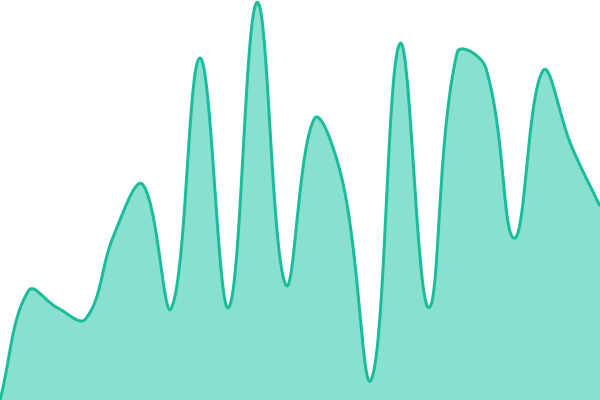
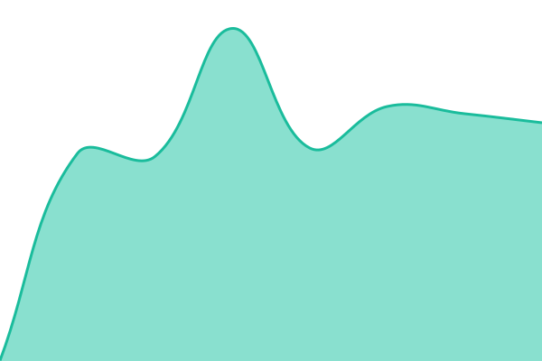

# [📈 Live Status](https://upptime.github.io/upptime): <!--live status--> **🟧 Partial outage**

This repository contains the open-source uptime monitor and status page for [Upptime](https://upptime.js.org), powered by [Upptime](https://github.com/upptime/upptime).

With [Upptime](https://upptime.js.org), you can get your own unlimited and free uptime monitor and status page, powered entirely by a GitHub repository. We use [Issues](https://github.com/upptime/upptime/issues) as incident reports, [Actions](https://github.com/b-urb/upptime/actions) as uptime monitors, and [Pages](https://upptime.github.io/upptime) for the status page.

<!--start: status pages-->
<!-- This summary is generated by Upptime (https://github.com/upptime/upptime) -->
<!-- Do not edit this manually, your changes will be overwritten -->
<!-- prettier-ignore -->
| URL | Status | History | Response Time | Uptime |
| --- | ------ | ------- | ------------- | ------ |
|  [Webcv](https://burbn.de) | 🟥 Down | [webcv.yml](https://github.com/b-urb/upptime/commits/HEAD/history/webcv.yml) | 

 1631ms
     
 | 

<a href="https://b-urb.github.io/upptime/history/webcv">95.08%</a>
    

|  [Tischlerei](https://tischlerei-bahrenberg.de) | 🟩 Up | [tischlerei.yml](https://github.com/b-urb/upptime/commits/HEAD/history/tischlerei.yml) | 

 342ms
     
 | 

<a href="https://b-urb.github.io/upptime/history/tischlerei">100.00%</a>
    

|  [CMS](https://cms.burbn.de) | 🟥 Down | [cms.yml](https://github.com/b-urb/upptime/commits/HEAD/history/cms.yml) | 

 608ms
     
 | 

<a href="https://b-urb.github.io/upptime/history/cms">95.09%</a>
    

|  [Proxy](https://voyage.burbn.de) | 🟩 Up | [proxy.yml](https://github.com/b-urb/upptime/commits/HEAD/history/proxy.yml) | 

 486ms
     
 | 

<a href="https://b-urb.github.io/upptime/history/proxy">100.00%</a>
    

<!--end: status pages-->

[**Visit our status website →**](https://upptime.github.io/upptime)

## 📄 License

- Powered by: [Upptime](https://github.com/upptime/upptime)
- Code: [MIT](./LICENSE) © [Upptime](https://upptime.js.org)
- Data in the `./history` directory: [Open Database License](https://opendatacommons.org/licenses/odbl/1-0/)
